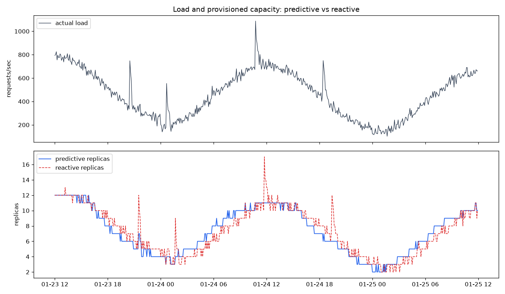

# AI-Based Predictive Scaling & Capacity Planning

Forecast future load and provision capacity **before** demand arrives — instead
of reacting to it after the fact.

This repository is a complete, runnable reference implementation: a synthetic
metrics generator, leakage-safe time-series feature engineering, a gradient-
boosted load forecaster, a capacity-sizing engine, an evaluation harness that
proves the value against a reactive baseline, a FastAPI service, tests, CI, and
a Docker image.



*Actual load (top) and the replica counts each policy provisions (bottom). The
predictive policy (blue) tracks the demand curve smoothly and leads the ramps;
the reactive policy (red) lags and overshoots — note the spike to 17 replicas
where predictive stays at 11.*

---

## Why predictive scaling?

Reactive autoscalers (Kubernetes HPA, AWS Target Tracking, …) add capacity
*after* a metric crosses a threshold. But capacity isn't instant — a new replica
must be scheduled, pulled, started, and warmed up (the **provisioning lead
time**). During that window the service runs under-provisioned exactly when
traffic is ramping, so latency spikes and requests fail.

Predictive scaling forecasts the load one lead-time ahead and provisions for it
now, so healthy capacity is already in place when the traffic lands. On the
synthetic benchmark in this repo, over one week of 5-minute traffic:

| Policy      | SLA breach steps | Replica-hours (cost) | Peak replicas |
|-------------|:---------------:|:--------------------:|:-------------:|
| Reactive    | 13              | 1159.8               | 18            |
| **Predictive** | **8**        | **1161.7**           | **14**        |

Predictive scaling cuts SLA breaches by ~38% at essentially identical cost, and
provisions more smoothly (lower peak). Reproduce these numbers with
`make demo`.

---

## Quickstart

```bash
# 1. Install (Python 3.10+)
python -m venv .venv && source .venv/bin/activate
pip install -e ".[dev]"

# 2. Run the end-to-end demo (generate -> train -> simulate + plot)
make demo
#   -> artifacts/model.joblib, artifacts/sim.csv, artifacts/sim.png

# 3. Serve the API and open the interactive docs
predictive-scaling serve            # http://localhost:8000/docs
```

Prefer containers?

```bash
docker compose up --build           # API on http://localhost:8000
```

---

## Step-by-step: how it works end to end

The pipeline is five stages. Each is a small, independently testable module.

```
metrics ─▶ features ─▶ forecast model ─▶ scaling engine ─▶ replica plan
```

### Step 1 — Get a load signal (`predictive_scaling.data`)

Real capacity planning starts from production telemetry (requests/sec, CPU, …).
For a self-contained demo we synthesise a signal with the same structure you see
in practice — base level, daily + weekly seasonality, a growth trend, noise, and
occasional spikes:

```python
from predictive_scaling.data import generate_load_series
from predictive_scaling.config import SimConfig

series = generate_load_series(SimConfig(days=45))["rps"]   # 5-min buckets
```

To use **your** data instead, export it to a CSV with `timestamp,rps` columns
and load it with `load_series_from_csv(...)`. Everything downstream is identical.

### Step 2 — Turn the series into features (`predictive_scaling.features`)

Forecasting is framed as supervised regression on the *next* observation. For
each timestamp `t` we build a feature vector from information available strictly
**before** `t`:

* **lag features** — the value 1, 2, 3, 6, 12 and 288 (one day) steps ago,
* **rolling statistics** — mean/std over recent windows (computed on the shifted
  series, so they never peek at `t`),
* **calendar features** — hour, day-of-week, weekend flag, and cyclical sin/cos
  encodings of time-of-day and day-of-week.

```python
from predictive_scaling.features import build_supervised_frame
X, y = build_supervised_frame(series, lags=[1, 2, 3, 12, 288], roll_windows=[6, 12])
```

> **Leakage-safety is the key correctness property.** No feature may contain
> information about the value it predicts. The test suite asserts this directly
> (`tests/test_features.py`).

### Step 3 — Train a forecaster (`predictive_scaling.models`)

A `HistGradientBoostingRegressor` learns the mapping features → next load.
Multi-step forecasts are produced **recursively**: predict `t+1`, append it,
re-featurise, predict `t+2`, out to the horizon.

```python
from predictive_scaling.models import LoadForecaster
from predictive_scaling.config import ModelConfig

model = LoadForecaster(ModelConfig(horizon=12)).fit(series)
forecast = model.forecast(12)      # next 12 steps (= 1 hour at 5-min buckets)
model.save("artifacts/model.joblib")
```

We always check the model against a **seasonal-naive baseline** ("load will be
what it was one day ago") — a learned model that can't beat that isn't earning
its keep. On the demo data the forecaster reaches **MAPE ≈ 10%** on an
out-of-sample backtest.

### Step 4 — Size the capacity (`predictive_scaling.scaling`)

The forecast answers *"how much load is coming?"*. The scaling engine answers
*"how many replicas, and when?"* using the sizing formula:

```
replicas = clamp( ceil( load × (1 + headroom) / (capacity × target_util) ), min, max )
```

```python
from predictive_scaling.scaling import ScalingEngine
from predictive_scaling.config import ScalingConfig

engine = ScalingEngine(ScalingConfig(per_replica_capacity=120, target_utilization=0.65))
decision = engine.recommend_now(forecast, current_replicas=4)
print(decision.replicas, decision.reason)
```

Scale-**out** applies immediately (safety first); scale-**in** waits out a
cool-down to avoid flapping on spiky traffic.

### Step 5 — Prove it works (`predictive_scaling.evaluation`)

`simulate_scaling` replays the load under both the predictive and a reactive
policy, giving **both the same provisioning lead time** so the only difference
is what load each aims at (forecast vs last-observed). It scores them on the two
things operators care about — SLA breaches and replica-hours:

```python
from predictive_scaling.evaluation import simulate_scaling
result = simulate_scaling(series)
print(result.summary())
```

This is what produces the table and plot above.

---

## Using the API

Start it (`predictive-scaling serve`) and explore the auto-generated OpenAPI docs
at `http://localhost:8000/docs`. Two core endpoints:

**`POST /forecast`** — forecast future load from recent history:

```bash
curl -s localhost:8000/forecast -H 'content-type: application/json' -d '{
  "history": [
    {"timestamp": "2024-03-01T00:00:00", "rps": 410.0},
    {"timestamp": "2024-03-01T00:05:00", "rps": 422.5}
  ],
  "steps": 6
}'
```

**`POST /recommend`** — forecast *and* return a replica recommendation:

```bash
curl -s localhost:8000/recommend -H 'content-type: application/json' -d '{
  "history": [ ...recent observations... ],
  "current_replicas": 4
}'
# -> {"recommended_replicas": 7, "delta": 3, "reason": "scale-out ...", ...}
```

A ready-to-run client is in [`examples/api_client.py`](examples/api_client.py).

A production controller would poll `/recommend` on a schedule with the last N
observations and the current replica count, then apply `recommended_replicas`
through its orchestrator (e.g. patch a Deployment's `spec.replicas` or set an HPA
floor), keeping a reactive HPA underneath as a safety net.

---

## CLI reference

Installed as `predictive-scaling` (also `python -m predictive_scaling`):

| Command    | What it does                                                   |
|------------|----------------------------------------------------------------|
| `generate` | Write a synthetic load series to CSV                            |
| `train`    | Fit a forecaster, run a backtest, save the model               |
| `forecast` | Load a model and print/save a forecast                         |
| `simulate` | Compare predictive vs reactive scaling (+ optional plot)       |
| `serve`    | Run the FastAPI service with uvicorn                           |

Run `predictive-scaling <command> -h` for options.

---

## Project layout

```
src/predictive_scaling/
├── config.py            # typed configuration (SimConfig, ModelConfig, ScalingConfig)
├── data/generator.py    # synthetic + CSV load series
├── features/            # leakage-safe time-series feature engineering
├── models/              # HistGradientBoosting forecaster + seasonal-naive baseline
├── scaling/engine.py    # forecast -> replica plan (sizing + cool-down)
├── evaluation.py        # backtest metrics + predictive-vs-reactive simulation
├── api/                 # FastAPI service (schemas + app)
└── cli.py               # command-line interface
tests/                   # pytest suite (generator, features, model, scaling, eval, api)
docs/architecture.md     # design rationale
.github/workflows/ci.yml # lint + test matrix + docker build
```

See [`docs/architecture.md`](docs/architecture.md) for the design rationale
behind each component.

---

## Development

```bash
make dev      # install with dev/test deps
make test     # run the test suite
make lint     # ruff
make fmt      # auto-format + fix
make demo     # full generate -> train -> simulate pipeline
make docker   # build the container image
```

CI runs the lint + test matrix on Python 3.10–3.12 and builds the Docker image
on every push and pull request.

## License

[MIT](LICENSE) © Abhishek Mittal
